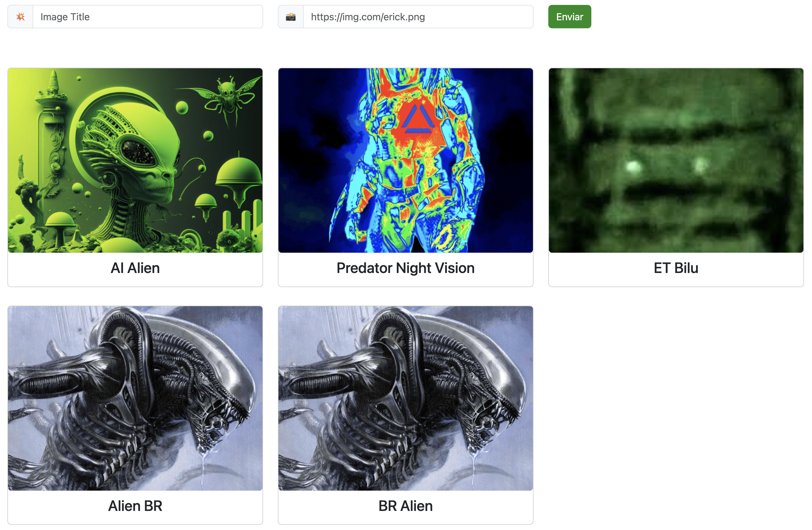

# Vanilla JS Web App example

This is a simple app website to store images on localStorage using best practices of accessibility.

[Access it live here](https://erickwendel.github.io/vanilla-js-web-app-example)

# Running

Restore the dependencies with `npm ci` and run with `npm start`.

